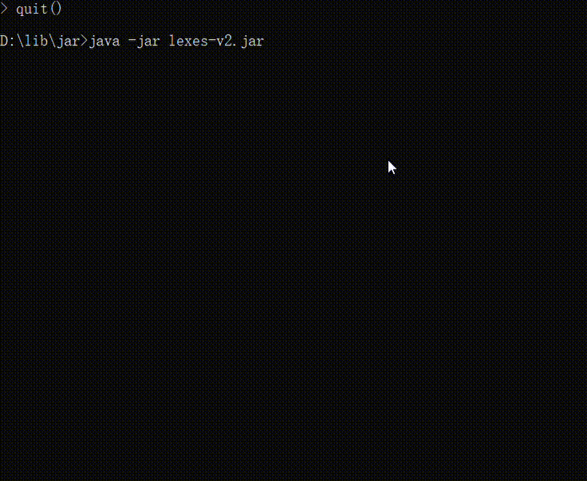

# lexes

a simple cached Java Terminal Calculator.


## Test Samples

```text
    "(1 + 2) * 3",                      // 9
    "(2 - 1) + (3 + 1)",                // 5
    "(2.5 - 0.5) * 2",                  // 4
    "((3.0 + 2) * 2) + 0 + (2 * 3)",    // 16
    "3 + (2 + 3) * 3",                  // 18
    "a = 2 + 3",                        // a = 5
    "b = a * 2",                        // b = 10
    "b = 10 - 2",                       // b = 8
    "b",                                // b = 8

```

## Test Result

```text

   (1 + 2) * 3 = 9.0
   (2 - 1) + (3 + 1) = 5.0
   (2.5 - 0.5) * 2 = 4.0
   ((3.0 + 2) * 2) + 0 + (2 * 3) = 16.0
   3 + (2 + 3) * 3 = 18.0
   a = 2 + 3 = 5.0
   b = a * 2 = 10.0
   b = 10 - 2 = 8.0
   b = 8.0
   c is not defined

```

## Basic Idea

### Created Queue


### Created Symbol-Tree

Here, the sub expression is equal to number in symbol tree that like `(2 + 3)`. You can think it is a
collapsible node in the binary tree. So, its left child is `)` when the parent node is `(`. the priority of Mul 
and Div is higher than ADD and SUB, but that is contrary in tree. When `*` meet the `+`, it will become the 
right child of the node(`+`), but become the parent node as usual.

#### Rules

- `(` and Number must be the right child (except the first number in expression)
- `(` is the flag of starting sub-expression, it only  holds moment `Root` point。
- `)` is the left child and its parent must be `(`


#### Specific Process

1. 初始化树，根节点默认为 `(`, 记为 `Root`指针。同时为其右节点设置一个 `)`节点；
2. 设置一个 `p` 节点记录根节点
3. 依次从队列中取出符号，生成节点，记为`ei`
   1. 如果 `ei` 为Number或者`(`时, 
      - 将`ei`设为右节点（若`Root`的右节点非空，不断向右查找其右节点）。根据规则2可知，如果父节点时`(`或者`ei`为
        `(`都需要向将`Root`指针向下传递（即其右节点用于`Root`指针）。

   2. 如果 `ei` 为 运算符时
      - 将`Root`指向的节点及其子树转移到`ei`的左节点上，`ei`取代`Root`在树中的位置，`Root`指针重新指向`ei`（这里`Root`指针位置上没有移动）
      - 例外，当`Root`指向运算符节点且`ei`的优先级低于 `Root`（例如，`*` 遇到 `+`），将`ei`取代`Root`的右节点，将原右节点移动到`ei`的左节点上，
   
   3. 如果 `ei` 为 `)`时
      - `Root`指针跳回到其父节点位置，设置其右节点为 `ei`。
4. 队列为空后，返回`p`的右子树，即可。

## Post-Order Traverse

After building symbol tree, We will use post-order traverse to calculate. When the point is located the middle node,
We will call its action.

## Result

if the root is 'Equal' Symbol, We need make the left child's data be a variable name, and make the right child's
data be the value. Then We save the key-value in HashMap. While, you could directly input an expression and don't
wish saving it, we only give the root's data. Lastly, we can show the result in Terminal or other.


------------

## Display


