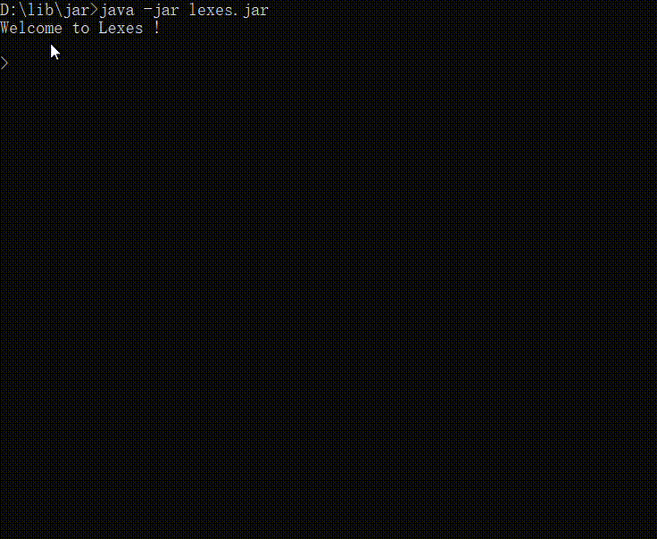
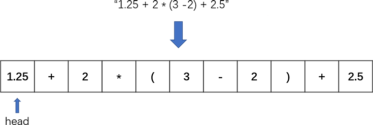

# lexes

a simple Four Operations Expression Analyzer.




## 测试样本

```text
    "1 + 2",                            // 3
    "2 + 3 * 2",                        // 8
    "3 - 2 / 2 * 4 + 4",                // 3
    "(1 + 2)",                          // 3
    "(1 + 2) * 3",                      // 9
    "(2 - 1) + (3 + 1)",                // 5
    "(2.5 - 0.5) * 2",                  // 4
    "((3.0 + 2) * 2) + 0 + (2 * 3)"     // 16
    "3 + (2 + 3) * 3"                   // 18

```

## 测试结果

```text

    1 + 2 = 3.0
    2 + 3 * 2 = 8.0
    3 - 2 / 2 * 4 + 4 = 3.0
    (1 + 2) = 3.0
    (1 + 2) * 3 = 9.0
    (2 - 1) + (3 + 1) = 5.0
    (2.5 - 0.5) * 2 = 4.0
    ((3.0 + 2) * 2) + 0 + (2 * 3) = 16.0
    3 + (2 + 3) * 3 = 18.0

```

## 基本思路

### 生成队列



### 生成符号树

这里，将例如“(2 + 3)”这样的子表达式，在符号树等价于 “5”，可以想象为二叉树上可以折叠的节点。所以当父节点为“(”，其右节点一定是”)“。
虽然乘法和除法的优先级高于加法和减法，在二叉树中却相反。当”*“遇到”+“将成为它右孩子，而非向一般的成为父节点。

1. 初始化树，根节点默认为 “(", 记为 Root
2. 设置一个 p 节点记录根节点
3. 依次从队列中取出符号，生成节点，记为ei
   1. 如果 ei 为Number 或 左括号，存在两种情况。

       - 若 Root 为左括号，将ei作为Root的右节点

      - 反之，将ei设为右节点（若Root的右节点非空，不断向右查找其右节点）
      
      - 例外，默认，是将Root 传递到 ei，但如果 ei 为 Number，但 Root也不为左括号，不应该这样做。

   2. 如果 ei 为 运算符时

      - 取代Root在树中的位置，并将Root及其子树转移到ei的左节点上

      - 例外，当Root也为运算符且ei的优先级低于 Root（例如，”*” 遇到 “+”），将ei取代Root的右节点，将原右节点移动到ei的左节点上，
4. 队里为空后，返回p的左孩子，即可。

## 遍历树

构建完符号树，采用后序遍历，从下至上进行运算。运算规则为，若游标节点处在运算符节点上，执行 ”左节点“ @ ”右节点“（其中 @代表运算符）；
如果处在左括号节点上，只需要节点的把其左节点的值copy过来，以便向上传递。

## 获取结果

最后，符号数的根节点的值即为文本表达式的运算结果。